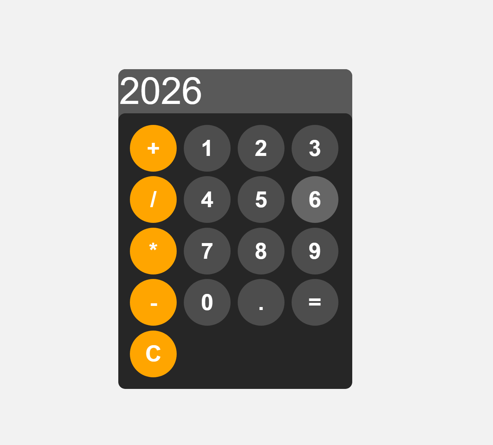

# Simple Calculator 🧮

A clean and minimal **calculator web application** built using **HTML, CSS, and JavaScript**.  
This project demonstrates basic DOM manipulation, event handling, and UI design for a functional calculator.

---

## 🚀 Features

- Basic arithmetic operations:
  - Addition (`+`)
  - Subtraction (`-`)
  - Multiplication (`*`)
  - Division (`/`)
- Clear (`C`) button to reset the calculator
- Decimal number support
- Responsive and modern UI
- Simple, beginner-friendly JavaScript logic

---

## 🛠️ Technologies Used

- **HTML** – Structure of the calculator  
- **CSS** – Styling and layout  
- **JavaScript** – Calculator logic and interactions  

---
